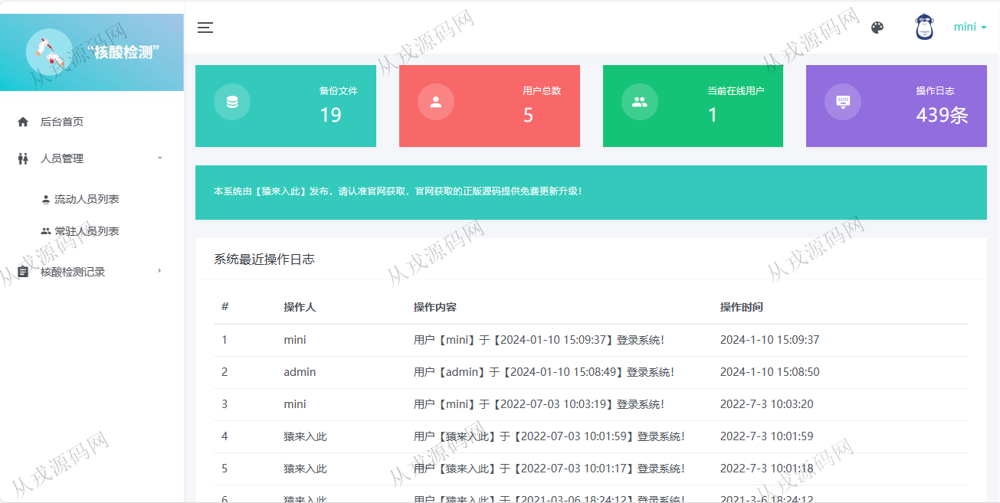
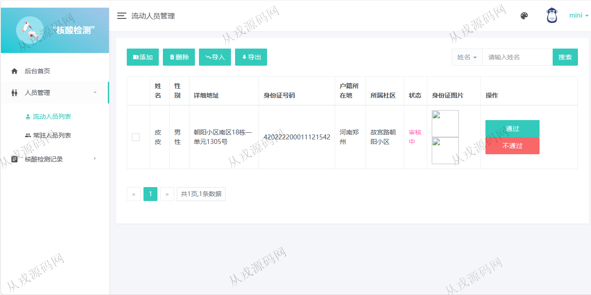
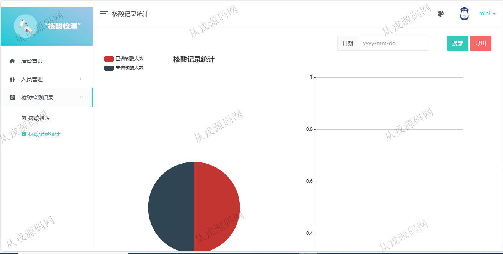
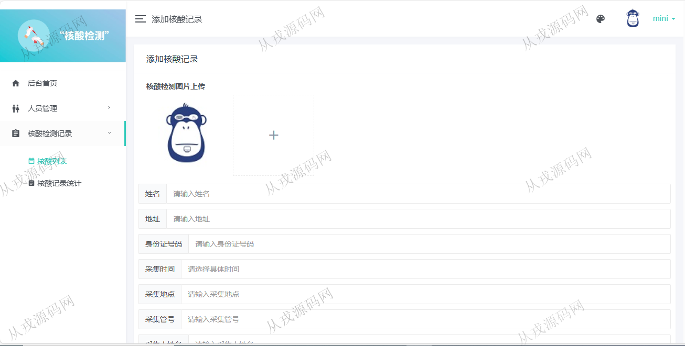
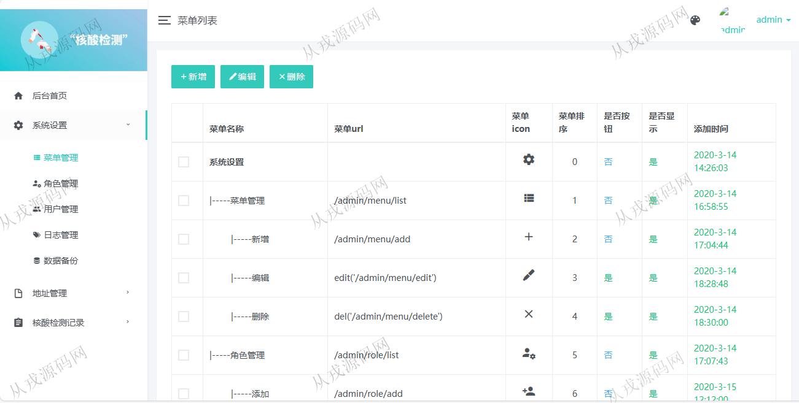
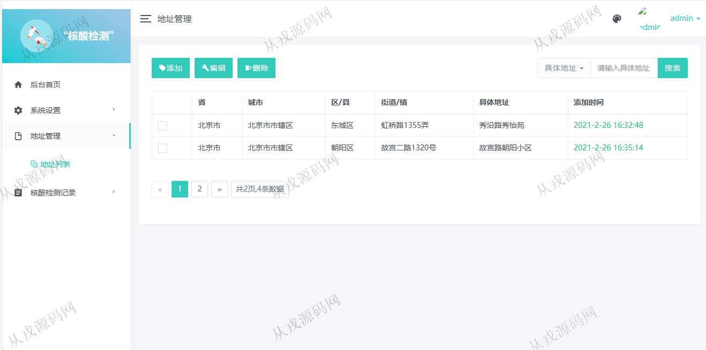
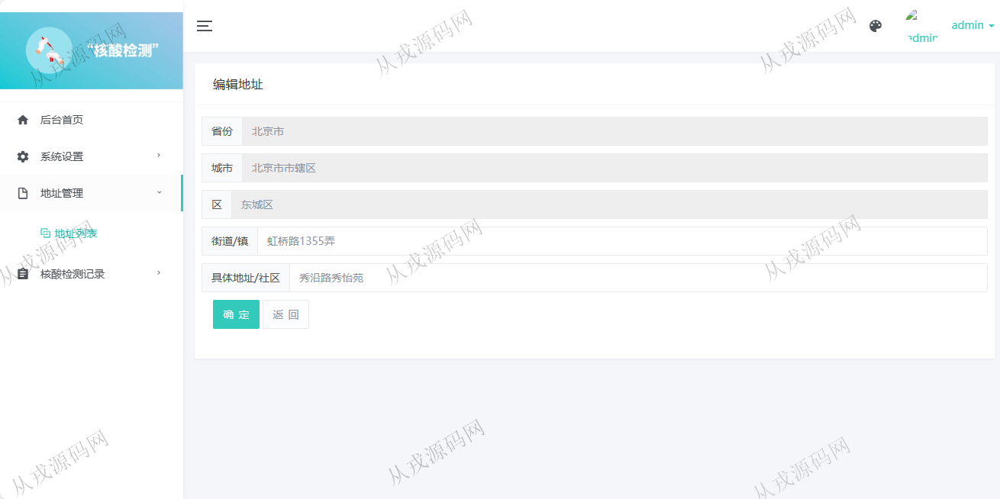

<h1 align="center">137.核酸检测管理系统</h1>

 获取sql文件 QQ: 386869957 QQ群: 377586148 

 [更多源码项目: 从戎源码网](https://armycodes.com/) 

## 简介

> 本代码来源于网络,仅供学习参考使用!
>
> 提供1.远程部署/2.修改代码/3.设计文档指导/4.框架代码讲解等服务
>
> http://localhost:8081/
>
> 管理员 : admin 123456
> 
> 检测人员 : mini 123456
>

## 项目介绍
基于springboot的核酸检测管理系统：前端 html、jquery、layui，后端 maven、springmvc、spring、hibernate；角色分为管理员、检测人员；集成地址管理、流动人员、常驻人员、核酸记录等功能于一体的系统。

## 功能介绍

### 管理员

- 后台首页：备份文件数，用户总数，当前在线用户，操作日志
- 菜单管理：菜单信息的增删改查
- 角色管理：角色信息的增删改查
- 用户管理：用户信息的增删改查，给用户分配角色
- 地址管理：地址信息的增删改查，省、市、区三级级联
- 核酸记录统计：饼图和柱状图展示数据

### 检测人员

- 流动人员：流动人员列表查询，数据手动添加录入，数据导入、导出，审核通过和不通过
- 常驻人员：常驻人员列表查询，数据手动添加录入，数据导入、导出
- 核酸记录列表：做核算人员记录登录，姓名、性别、身份证号码、采集时间、采集地点、状态
- 核酸记录统计：饼图和柱状图展示数据

## 环境

- <b>IntelliJ IDEA 2021.3</b>

- <b>Mysql 5.7.26</b>

- <b>JDK 1.8</b>

## 运行截图

